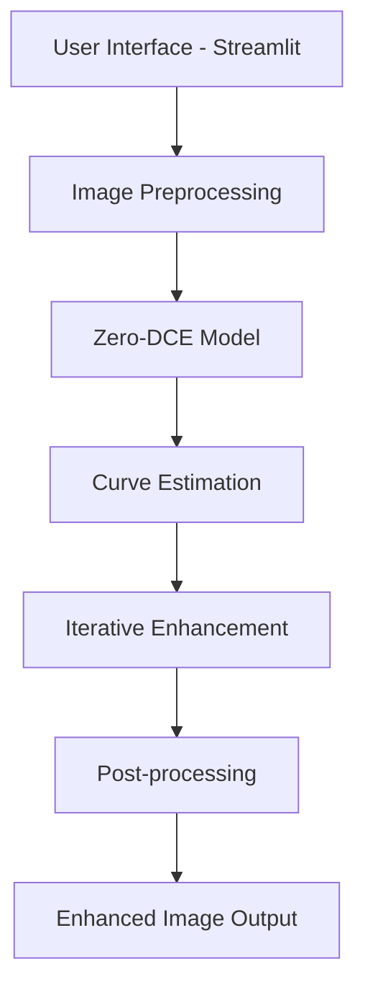

# 📚 Low Light Image Enhancer - Technical Documentation

## 🏗️ Architecture Overview

### System Components



### Model Architecture: Zero-DCE

The Zero-Reference Deep Curve Estimation (Zero-DCE) model consists of:

1. **Deep Curve Estimation Network**: 7 convolutional layers with skip connections
2. **Curve Application**: 8 iterations of curve-based pixel transformations
3. **Loss Functions**: Multiple loss components for natural enhancement

## 🔧 Implementation Details

### Core Enhancement Algorithm

```python
def enhance_image(model, image, intensity=3.0):
    # 1. Preprocess image
    input_tensor = preprocess_image(image)
    
    # 2. Predict enhancement curves
    curve = model.predict(input_tensor)
    curve = curve * intensity  # Amplify enhancement
    
    # 3. Apply curves iteratively
    x = tf.convert_to_tensor(input_tensor)
    for i in range(8):
        a = curve[..., i*3:(i+1)*3]
        x = x + a * (tf.square(x) - x)
    
    # 4. Post-process and return
    enhanced = np.clip(x[0].numpy() * 255.0, 0, 255).astype(np.uint8)
    return Image.fromarray(enhanced)
```

### Loss Functions

#### 1. Illumination Smoothness Loss
```python
def illumination_smoothness_loss(x):
    """Ensures smooth illumination transitions"""
    batch_size = tf.shape(x)[0]
    h_x, w_x = tf.shape(x)[1], tf.shape(x)[2]
    
    # Calculate horizontal and vertical variations
    h_tv = tf.reduce_sum(tf.square(x[:, 1:, :, :] - x[:, :h_x-1, :, :]))
    w_tv = tf.reduce_sum(tf.square(x[:, :, 1:, :] - x[:, :, :w_x-1, :]))
    
    return 2 * (h_tv + w_tv) / tf.cast(batch_size, tf.float32)
```

#### 2. Exposure Loss
```python
def exposure_loss(x, mean_val=0.6):
    """Maintains proper exposure levels"""
    x = tf.reduce_mean(x, axis=3, keepdims=True)
    mean = tf.nn.avg_pool2d(x, ksize=16, strides=16, padding="VALID")
    return tf.reduce_mean(tf.square(mean - mean_val))
```

#### 3. Color Constancy Loss
```python
def color_constancy_loss(image):
    """Preserves color balance across channels"""
    r, g, b = image[:, :, :, 0], image[:, :, :, 1], image[:, :, :, 2]
    r_mean, g_mean, b_mean = tf.reduce_mean(r), tf.reduce_mean(g), tf.reduce_mean(b)
    return tf.square(r_mean - g_mean) + tf.square(r_mean - b_mean) + tf.square(g_mean - b_mean)
```

## 📊 Performance Optimization

### Model Caching
```python
@st.cache_resource
def load_model(path="../models/LOW_LIGHT_MODEL.h5"):
    """Cache model to avoid reloading on each run"""
    return tf.keras.models.load_model(path, compile=False)
```

### Batch Processing
- Supports ZIP file uploads for multiple images
- Automatic cleanup of temporary files
- Memory-efficient processing

### GPU Acceleration
The model automatically uses GPU if CUDA is available:
```python
# Check GPU availability
physical_devices = tf.config.experimental.list_physical_devices('GPU')
if physical_devices:
    tf.config.experimental.set_memory_growth(physical_devices[0], True)
```

## 🔍 Troubleshooting

### Common Issues

1. **Model Not Found Error**
   - Ensure model files are in the `models/` directory
   - Check file permissions

2. **Memory Issues**
   - Reduce batch size
   - Close other applications
   - Use smaller image sizes

3. **Slow Processing**
   - Install CUDA for GPU acceleration
   - Use smaller images for testing
   - Check system resources

### Performance Monitoring

```python
import time
import psutil

def monitor_enhancement(func):
    def wrapper(*args, **kwargs):
        start_time = time.time()
        start_memory = psutil.virtual_memory().used
        
        result = func(*args, **kwargs)
        
        end_time = time.time()
        end_memory = psutil.virtual_memory().used
        
        print(f"Processing time: {end_time - start_time:.2f}s")
        print(f"Memory used: {(end_memory - start_memory) / 1024**2:.2f} MB")
        
        return result
    return wrapper
```

## 🧪 Testing

### Unit Tests
```python
import unittest
from src.app import preprocess_image, enhance_image
from PIL import Image
import numpy as np

class TestImageProcessing(unittest.TestCase):
    def test_preprocess_image(self):
        # Create test image
        test_image = Image.new('RGB', (256, 256), color='red')
        processed = preprocess_image(test_image)
        
        # Check dimensions and range
        self.assertEqual(processed.shape, (1, 512, 512, 3))
        self.assertTrue(0 <= processed.min() and processed.max() <= 1)
    
    def test_enhance_image(self):
        # Test enhancement pipeline
        model = load_model()
        test_image = Image.new('RGB', (256, 256), color='black')
        enhanced = enhance_image(model, test_image)
        
        # Enhanced image should be brighter
        self.assertIsInstance(enhanced, Image.Image)
```

### Integration Tests
```bash
# Run all tests
python -m pytest tests/

# Run with coverage
python -m pytest --cov=src tests/
```

## 🚀 Deployment

### Local Deployment
```bash
streamlit run src/app.py --server.port 8501
```

### Docker Deployment
```dockerfile
FROM python:3.9-slim

WORKDIR /app
COPY requirements.txt .
RUN pip install -r requirements.txt

COPY . .
EXPOSE 8501

CMD ["streamlit", "run", "src/app.py", "--server.address", "0.0.0.0"]
```

### Cloud Deployment (Streamlit Cloud)
1. Push to GitHub
2. Connect to Streamlit Cloud
3. Deploy from repository

## 📈 Future Enhancements

### Planned Features
- [ ] Real-time video enhancement
- [ ] Mobile app version
- [ ] API endpoint for developers
- [ ] Advanced fine-tuning options
- [ ] Custom model training interface

### Model Improvements
- [ ] Support for higher resolutions
- [ ] Faster inference times
- [ ] Better color preservation
- [ ] Scene-adaptive enhancement

## 📞 Support

For technical support or questions:
- 📧 Email: support@lowlightenhancer.com
- 💬 Discord: [Join our community](https://discord.gg/lowlight)
- 🐛 Issues: [GitHub Issues](https://github.com/NiceNewton/lol/issues)
- 📖 Wiki: [Project Wiki](https://github.com/NiceNewton/lol/wiki)
